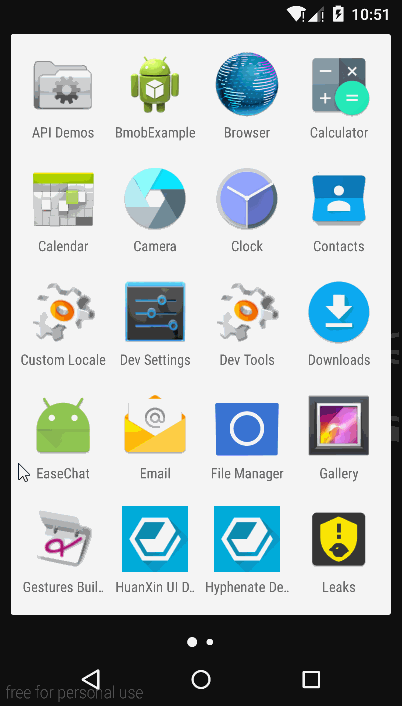

EaseChat
========

### 前言
环信已经发部了`SDK3.x`版本，`SDK3.x`相对于`SDK2.x`来说是整个进行了重写，`API`变化还是比较大的，已经熟悉`SDK2.x`的开发者在使用新的`SDK3.x`还是会遇到不少问题的，不过还好官方给出了`SDK2.x`升级`SDK3.x`指南，已经熟悉`SDK2.x`开发者可以根据文档了解`SDK3.x`的变化，新集成的开发者可以直接参考`SDK3.x`进行集成；
这里简单的实现了sdk的初始化以及注册登录和收发消息，不过ui上没有没有去做很好的处理

> 如果你还是用的`Eclipse`，可以下载`AndroidStudio`尝试下，如果你上不了`Android`官网，不懂怎么翻墙可以找下国内开发提供的一些地址

### 先看效果图   
    

### 开发环境
这里并不是一定要按照我的配置来，只是说下当前项目开发运行的环境，如果你的开发环境不同可能需要自己修改下项目配置`build.gradle`文件

>系统 Mac
AndroidStudio 3.0.0
Gradle 4.1（跟随AndroidStudio 一起更新）
Android compileSdkVersion 27
Android buildToolsVersion 27.0.3
Android Support 最新
环信 SDK 3.4.0

### 地址整理
>项目地址
[lzan13](https://github.com/lzan13) / [EaseChat](https://github.com/lzan13/EaseChat)

>AndroidStudio下载
[Android官方下载](http://tools.android.com/download/studio/builds/2-0)
[国内提供 AndroidDevTools](http://androiddevtools.cn/)

>模拟器 Genymotion下载
[Genymotion 官网](http://genymotion.com/)

>环信官方文档
[SDK3.x 文档](http://docs.easemob.com/im/start)
[SDK3.x API 文档](http://www.easemob.com/apidoc/android/chat3.0/annotated.html)
[SDK2.x 升级 SDK3.x 文档](http://docs.easemob.com/im/200androidcleintintegration/140upgradetov30)

>[关于环信3.xSDK日志简单分析](https://www.jianshu.com/p/a194fa19bd6a)
>[使用环信3.xSDK集成小米推送实现消息以及通话时的离线通知](https://www.jianshu.com/p/df892008ca5e)
>[使用第三方库出现找不到so库UnsatisfiedLinkError错误的原因以及解决方案](https://www.jianshu.com/p/b9a524f24b7e)

* 项目详细介绍
[项目文章详细介绍](http://www.jianshu.com/p/3e732f45d376)

### 延伸项目
这里还有一个针对音视频的项目，集成了1V1以及多人音视频的项目，还算比较完整，有兴趣的可以看看
> 音视频项目：[VMChatDemoCall](https://github.com/lzan13/VMChatDemoCall)

